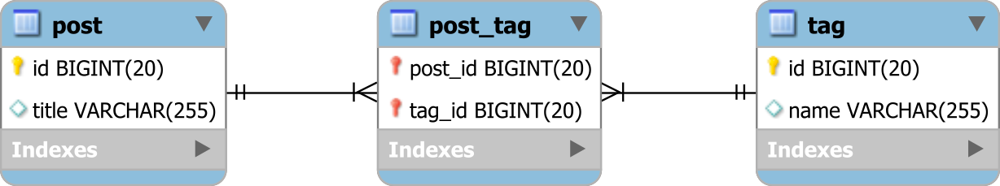
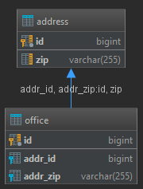

JPA (Java Persistence API) is a rich specification that provides a lot of features to interact with relational databases. While `EntityGraph` is a powerful feature to optimize the loading of entities, there are many other important concepts and features in JPA that you should be familiar with. Here's a list of some key concepts and features:

1. **Basic Annotations**:
    - `@Entity`: Marks a class as an entity.
    - `@Table`: Specifies the table for an entity class.
    - `@Id`: Specifies the primary key.
    - `@GeneratedValue`: Provides generation strategies for primary keys.

2. **Relationship Mappings**:
    - `@OneToOne`, `@OneToMany`, `@ManyToOne`, `@ManyToMany`: Define the various types of relationships between entities.
    - `@JoinColumn`: Specifies a column for joining an entity association or element collection.
      - The `@JoinColumn` annotation combined with a ```@OneToOne``` mapping indicates that a given column in the owner entity refers to a primary key in the reference entity:
    ```
    @Entity
    public class Office {
    @OneToOne(fetch = FetchType.LAZY)
    @JoinColumn(name = "addressId")
    private Address address;
    }
    ```
   - When using a ```@OneToMany``` mapping, we can use the mappedBy parameter to indicate that the given column is owned by another entity:
```
@Entity
public class Employee {
 
    @Id
    private Long id;

    @OneToMany(fetch = FetchType.LAZY, mappedBy = "employee")
    private List<Email> emails;
}

@Entity
public class Email {
 
    @ManyToOne(fetch = FetchType.LAZY)
    @JoinColumn(name = "employee_id")
    private Employee employee;
}
```

- ```@JoinTable```: Specifies the table that is used for many-to-many mappings and unidirectional one-to-many mappings.
  - ***```@ManyToMany```associations***

      Most often, you will need to use @JoinTable annotation to specify the mapping of a many-to-many table relationship:
      - the name of the link table and 
      - the two Foreign Key columns
So, assuming you have the following database tables:

**Many-to-many table relationship**
- 
In the Post entity, you would map this relationship, like this:
````
@ManyToMany(cascade = {
CascadeType.PERSIST,
CascadeType.MERGE
})
@JoinTable(
name = "post_tag",
joinColumns = @JoinColumn(name = "post_id"),
inverseJoinColumns = @JoinColumn(name = "tag_id")
)
private List<Tag> tags = new ArrayList<>();
````

   - The ```@JoinTable``` annotation is used to specify the table name via the name attribute, as well as the Foreign Key column that references the post table (e.g., joinColumns) and the Foreign Key column in the post_tag link table that references the Tag entity via the inverseJoinColumns attribute.

   - **Notice that the cascade attribute of the @ManyToMany annotation is set to PERSIST and MERGE only because cascading REMOVE is a bad idea since we the DELETE statement will be issued for the other parent record, tag in our case, not to the post_tag record.**

**```@JoinColumns```**

In situations when we want to create multiple join columns, we can use the @JoinColumns annotation:

```
@Entity
public class Office {
    @ManyToOne(fetch = FetchType.LAZY)
    @JoinColumns({
        @JoinColumn(name="ADDR_ID", referencedColumnName="ID"),
        @JoinColumn(name="ADDR_ZIP", referencedColumnName="ZIP")
    })
    private Address address;
}
```


3. **Fetch Types**:
    - `EAGER` vs. `LAZY`: Understand the difference and when to use each type.

4. **Cascade Types**: Understand the various cascade operations like `PERSIST`, `MERGE`, `REMOVE`, etc.
   What Is Cascading?

    - Entity relationships often depend on the existence of another entity, for example the Person–Address relationship. Without the Person, the Address entity doesn't have any meaning of its own. When we delete the Person entity, our Address entity should also get deleted.
      Cascading is the way to achieve this. When we perform some action on the target entity, the same action will be applied to the associated entity.
     - All JPA-specific cascade operations are represented by the javax.persistence.CascadeType enum containing entries:
    - ALL 
    - PERSIST 
    - MERGE 
    - REMOVE 
    - REFRESH 
    - DETACH
    - 
5. **Query Language (JPQL)**: Learn how to write JPQL queries to fetch data based on certain criteria.

6. **Criteria API**: A type-safe way to write queries programmatically.

7. **Native Queries**: Execute native SQL queries using JPA.

8. **Callbacks and Listeners**: Use entity lifecycle callbacks (`@PrePersist`, `@PostLoad`, etc.) and entity listeners to perform certain actions during the lifecycle of an entity.

9. **Embeddables**: Use `@Embeddable` and `@Embedded` to embed objects within entities.

10. **Inheritance Mapping**: Understand the different strategies (`SINGLE_TABLE`, `JOINED`, `TABLE_PER_CLASS`) for mapping inheritance hierarchies.

11. **Locking**: Understand the different types of locking mechanisms (`OPTIMISTIC`, `PESSIMISTIC`) and how to handle concurrency.

12. **Caching**: Learn about the first-level cache and the second-level cache, and how to use and configure them.

13. **Transactions**: Understand transaction boundaries and how to manage transactions in JPA.

14. **Named Queries**: Use `@NamedQuery` and `@NamedQueries` to define queries statically.

15. **Stored Procedures**: Call stored procedures and functions using the `@NamedStoredProcedureQuery` annotation.

16. **Converters**: Use `@Converter` to define custom conversions between attribute values in the entity model and database column values.

17. **Validation**: Integrate Bean Validation with JPA to validate entity attributes.

18. **Pagination**: Implement pagination in JPA to efficiently fetch large datasets.

19. **Bulk Operations**: Use bulk `UPDATE` and `DELETE` operations for performance optimization.

20. **Auditing**: Use auditing features to track changes in entities.

It's also beneficial to familiarize yourself with the underlying provider (e.g., Hibernate, EclipseLink) and its specific features and optimizations. Moreover, always refer to the official documentation and best practices when working with JPA to ensure efficient and maintainable code.